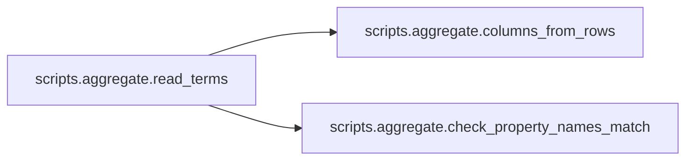
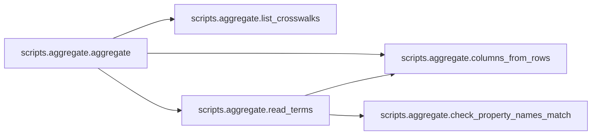
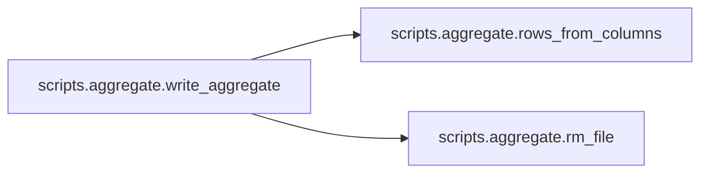
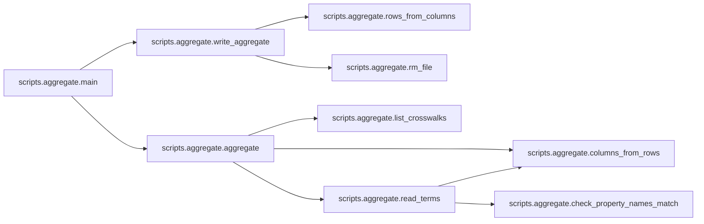

# Scripts

[_Documentation generated by Documatic_](https://www.documatic.com)

<!---Documatic-section-Codebase Structure-start--->
## Codebase Structure

<!---Documatic-block-system_architecture-start--->
```mermaid
None
```
<!---Documatic-block-system_architecture-end--->

# #
<!---Documatic-section-Codebase Structure-end--->

<!---Documatic-section-scripts.aggregate.check_property_names_match-start--->
## [scripts.aggregate.check_property_names_match](3-scripts.md#scripts.aggregate.check_property_names_match)

<!---Documatic-section-check_property_names_match-start--->
<!---Documatic-block-scripts.aggregate.check_property_names_match-start--->
<details>
	<summary><code>scripts.aggregate.check_property_names_match</code> code snippet</summary>

```python
def check_property_names_match(filename, properties1, properties2):
    for (prop1, prop2) in zip(properties1, properties2):
        if prop1 != prop2:
            print('Error in {}: property names {} and {} should be the same'.format(filename, prop1, prop2))
            exit(1)
```
</details>
<!---Documatic-block-scripts.aggregate.check_property_names_match-end--->
<!---Documatic-section-check_property_names_match-end--->

# #
<!---Documatic-section-scripts.aggregate.check_property_names_match-end--->

<!---Documatic-section-scripts.aggregate.columns_from_rows-start--->
## [scripts.aggregate.columns_from_rows](3-scripts.md#scripts.aggregate.columns_from_rows)

<!---Documatic-section-columns_from_rows-start--->
<!---Documatic-block-scripts.aggregate.columns_from_rows-start--->
<details>
	<summary><code>scripts.aggregate.columns_from_rows</code> code snippet</summary>

```python
def columns_from_rows(rows):
    return list(zip(*rows))
```
</details>
<!---Documatic-block-scripts.aggregate.columns_from_rows-end--->
<!---Documatic-section-columns_from_rows-end--->

# #
<!---Documatic-section-scripts.aggregate.columns_from_rows-end--->

<!---Documatic-section-scripts.aggregate.rows_from_columns-start--->
## [scripts.aggregate.rows_from_columns](3-scripts.md#scripts.aggregate.rows_from_columns)

<!---Documatic-section-rows_from_columns-start--->
<!---Documatic-block-scripts.aggregate.rows_from_columns-start--->
<details>
	<summary><code>scripts.aggregate.rows_from_columns</code> code snippet</summary>

```python
def rows_from_columns(cols):
    return list(zip(*cols))
```
</details>
<!---Documatic-block-scripts.aggregate.rows_from_columns-end--->
<!---Documatic-section-rows_from_columns-end--->

# #
<!---Documatic-section-scripts.aggregate.rows_from_columns-end--->

<!---Documatic-section-scripts.aggregate.read_terms-start--->
## [scripts.aggregate.read_terms](3-scripts.md#scripts.aggregate.read_terms)

<!---Documatic-section-read_terms-start--->


### Object Calls

* [scripts.aggregate.columns_from_rows](3-scripts.md#scripts.aggregate.columns_from_rows)
* [scripts.aggregate.check_property_names_match](3-scripts.md#scripts.aggregate.check_property_names_match)

<!---Documatic-block-scripts.aggregate.read_terms-start--->
<details>
	<summary><code>scripts.aggregate.read_terms</code> code snippet</summary>

```python
def read_terms(prop_desc, filename):
    with open(os.path.join(SOURCE_DIR, filename)) as fd:
        rows = list(csv.reader(fd))
    (codemeta_names, crosswalk_names) = columns_from_rows(rows)
    check_property_names_match(filename, prop_desc[1], codemeta_names)
    return crosswalk_names
```
</details>
<!---Documatic-block-scripts.aggregate.read_terms-end--->
<!---Documatic-section-read_terms-end--->

# #
<!---Documatic-section-scripts.aggregate.read_terms-end--->

<!---Documatic-section-scripts.aggregate.list_crosswalks-start--->
## [scripts.aggregate.list_crosswalks](3-scripts.md#scripts.aggregate.list_crosswalks)

<!---Documatic-section-list_crosswalks-start--->
<!---Documatic-block-scripts.aggregate.list_crosswalks-start--->
<details>
	<summary><code>scripts.aggregate.list_crosswalks</code> code snippet</summary>

```python
def list_crosswalks():
    if USE_OLD_ORDER:
        return OLD_ORDER
    else:
        return sorted(os.listdir(SOURCE_DIR))
```
</details>
<!---Documatic-block-scripts.aggregate.list_crosswalks-end--->
<!---Documatic-section-list_crosswalks-end--->

# #
<!---Documatic-section-scripts.aggregate.list_crosswalks-end--->

<!---Documatic-section-scripts.aggregate.aggregate-start--->
## [scripts.aggregate.aggregate](3-scripts.md#scripts.aggregate.aggregate)

<!---Documatic-section-aggregate-start--->


### Object Calls

* [scripts.aggregate.list_crosswalks](3-scripts.md#scripts.aggregate.list_crosswalks)
* [scripts.aggregate.columns_from_rows](3-scripts.md#scripts.aggregate.columns_from_rows)
* [scripts.aggregate.read_terms](3-scripts.md#scripts.aggregate.read_terms)

<!---Documatic-block-scripts.aggregate.aggregate-start--->
<details>
	<summary><code>scripts.aggregate.aggregate</code> code snippet</summary>

```python
def aggregate():
    with open(PROP_DESC_PATH) as fd:
        prop_desc = columns_from_rows(csv.reader(fd))
    columns = []
    for filename in list_crosswalks():
        if filename.endswith('.csv'):
            columns.append(read_terms(prop_desc, filename))
    return prop_desc + columns
```
</details>
<!---Documatic-block-scripts.aggregate.aggregate-end--->
<!---Documatic-section-aggregate-end--->

# #
<!---Documatic-section-scripts.aggregate.aggregate-end--->

<!---Documatic-section-scripts.aggregate.rm_file-start--->
## [scripts.aggregate.rm_file](3-scripts.md#scripts.aggregate.rm_file)

<!---Documatic-section-rm_file-start--->
<!---Documatic-block-scripts.aggregate.rm_file-start--->
<details>
	<summary><code>scripts.aggregate.rm_file</code> code snippet</summary>

```python
def rm_file(filename):
    try:
        os.unlink(filename)
    except FileNotFoundError:
        pass
```
</details>
<!---Documatic-block-scripts.aggregate.rm_file-end--->
<!---Documatic-section-rm_file-end--->

# #
<!---Documatic-section-scripts.aggregate.rm_file-end--->

<!---Documatic-section-scripts.aggregate.write_aggregate-start--->
## [scripts.aggregate.write_aggregate](3-scripts.md#scripts.aggregate.write_aggregate)

<!---Documatic-section-write_aggregate-start--->


### Object Calls

* [scripts.aggregate.rows_from_columns](3-scripts.md#scripts.aggregate.rows_from_columns)
* [scripts.aggregate.rm_file](3-scripts.md#scripts.aggregate.rm_file)

<!---Documatic-block-scripts.aggregate.write_aggregate-start--->
<details>
	<summary><code>scripts.aggregate.write_aggregate</code> code snippet</summary>

```python
def write_aggregate(aggregate_columns):
    rows = rows_from_columns(aggregate_columns)
    rm_file(DEST_FILENAME)
    with open(DEST_FILENAME, 'a') as fd:
        writer = csv.writer(fd, lineterminator='\n')
        writer.writerows(rows)
```
</details>
<!---Documatic-block-scripts.aggregate.write_aggregate-end--->
<!---Documatic-section-write_aggregate-end--->

# #
<!---Documatic-section-scripts.aggregate.write_aggregate-end--->

<!---Documatic-section-scripts.aggregate.main-start--->
## [scripts.aggregate.main](3-scripts.md#scripts.aggregate.main)

<!---Documatic-section-main-start--->


### Object Calls

* [scripts.aggregate.write_aggregate](3-scripts.md#scripts.aggregate.write_aggregate)
* [scripts.aggregate.aggregate](3-scripts.md#scripts.aggregate.aggregate)

<!---Documatic-block-scripts.aggregate.main-start--->
<details>
	<summary><code>scripts.aggregate.main</code> code snippet</summary>

```python
def main():
    write_aggregate(aggregate())
```
</details>
<!---Documatic-block-scripts.aggregate.main-end--->
<!---Documatic-section-main-end--->

# #
<!---Documatic-section-scripts.aggregate.main-end--->

<!---Documatic-section-scripts.split.rm_file-start--->
## [scripts.split.rm_file](3-scripts.md#scripts.split.rm_file)

<!---Documatic-section-rm_file-start--->
<!---Documatic-block-scripts.split.rm_file-start--->
<details>
	<summary><code>scripts.split.rm_file</code> code snippet</summary>

```python
def rm_file(filename):
    try:
        os.unlink(filename)
    except FileNotFoundError:
        pass
```
</details>
<!---Documatic-block-scripts.split.rm_file-end--->
<!---Documatic-section-rm_file-end--->

# #
<!---Documatic-section-scripts.split.rm_file-end--->

[_Documentation generated by Documatic_](https://www.documatic.com)